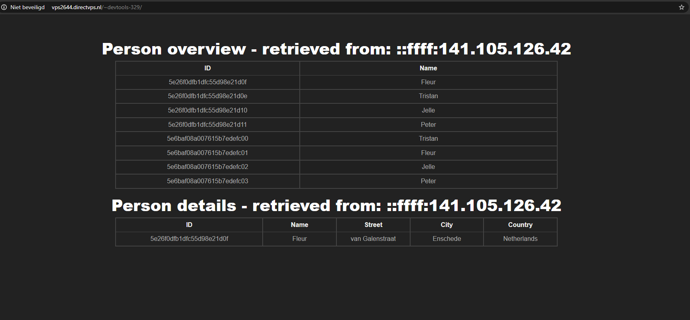

# Development Tools: Docker - Week 7

## My added users

Ik heb 4 mensen toegevoegd: Pluk; Aagje; Harry Potter en Ron Weasley.

```json
[
    {
        "name": "Pluk",
        "street": "Petteflet",
        "city": "Narnia",
        "country": "Fantasieland"
    },
    {
        "name": "Aagje",
        "street": "Petteflet",
        "city": "Narnia",
        "country": "Fantasieland"
    },
    {
        "name": "Harry Potter",
        "street": "4 Privet Drive",
        "city": "Little Whinging",
        "country": "England"
    },
    {
        "name": "Ron Weasley",
        "street": "Ottery St Catchpole",
        "city": "Devon",
        "country": "England"
    }
]
```

## Seeding database

Ik heb een docker image gebruikt genaamt 'mongo-seed' van ene 'stefanwalther'. Ik heb voor deze image gekozen omdat deze recent was geupdate. Ik heb nog een andere image gevonden genaamd 'mongo-seeding'. Deze heeft veel meer functionaliteit, maar is ook veel complexer om op te zetten en dat leek me onnodig.

Deze image vereiste een JSON bestand met een array. Die moest je kopieren. In het voorbeeld ging dit naar `/data`. Dit leek mij ook een logische plek dus daar heb ik het bij gelaten. De rest van het commando spreekt voor zich. Een paar arguments die vertellen dat het een JSON bestand is met een JSON array, en waar dit bestand gevonden kan worden.


# Screenshot

